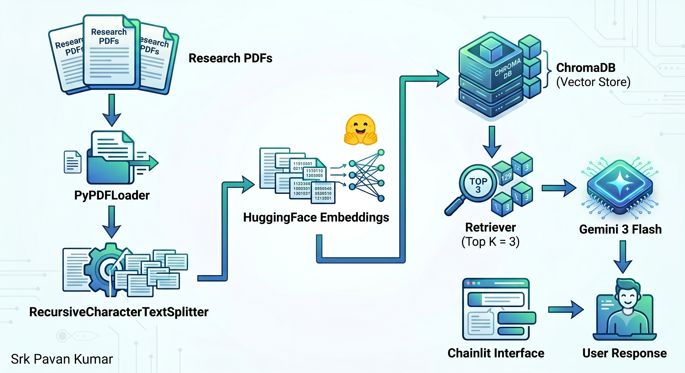
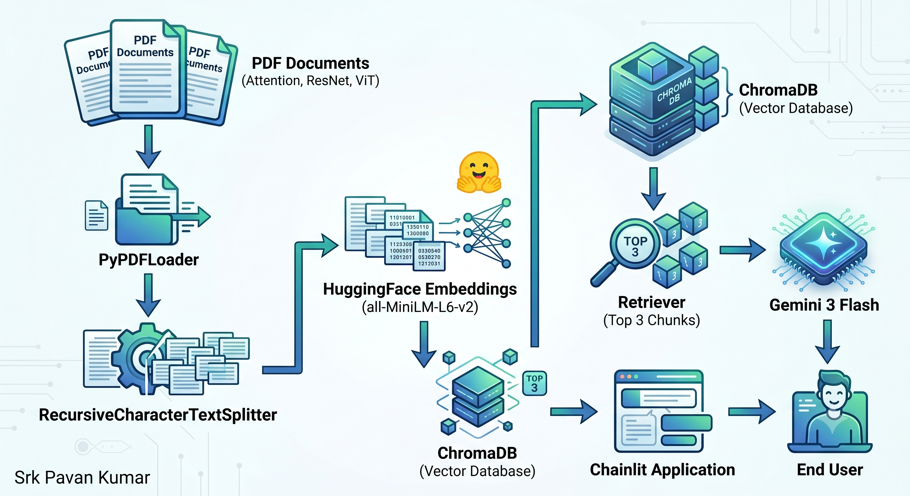
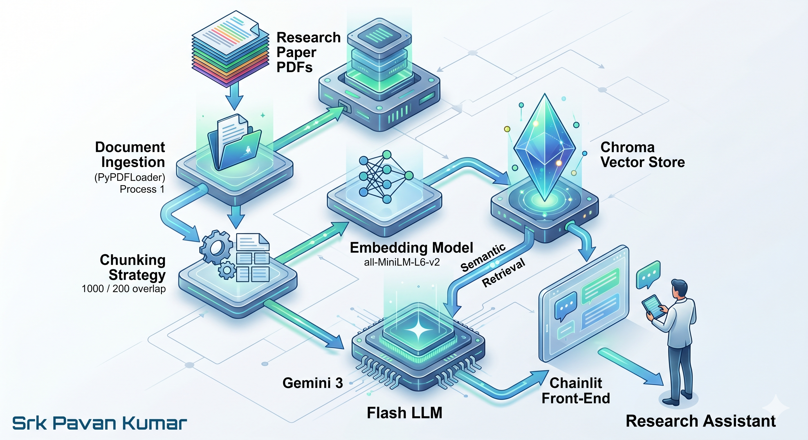
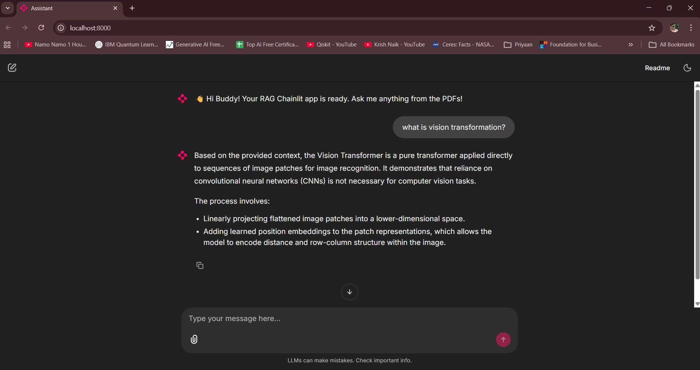
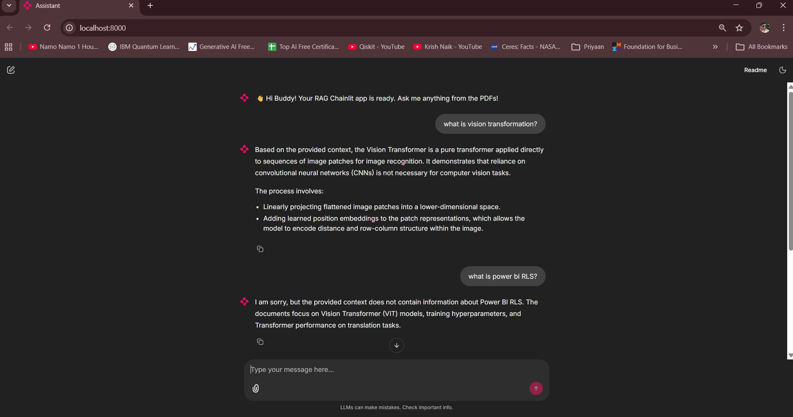

# 📚 Research Assistant Chainlit RAG

> AI-powered Research Assistant built using Gemini, ChromaDB, HuggingFace Embeddings, LangChain, and Chainlit for intelligent question-answering over research papers.


---

## Project Context

This project demonstrates the implementation of a Retrieval-Augmented Generation (RAG) application that enables users to interact with research papers using natural language.

The solution leverages semantic retrieval and large language models to provide contextual answers grounded in the uploaded documents.

---

## Problem Statement

Researchers and learners often spend significant time navigating lengthy research papers to find specific information.

Traditional keyword-based search lacks semantic understanding and contextual retrieval.

This project addresses the challenge by implementing a Research Assistant capable of retrieving relevant document chunks and generating grounded responses using Gemini and ChromaDB.

---

## Key Features

* Multi-document research assistant
* Research paper question answering
* Semantic document retrieval
* ChromaDB vector database
* Gemini 3 Flash integration
* HuggingFace Embeddings
* Chainlit conversational interface
* End-to-end RAG pipeline

---

## High-Level Architecture

### User Flow


### Developer Flow


### Enterprise Architecture


---

## Solution Architecture

The application follows a Retrieval-Augmented Generation workflow:

1. Research papers are loaded using PyPDFLoader.
2. Documents are split into manageable chunks.
3. HuggingFace embeddings are generated.
4. Chunks are stored in ChromaDB.
5. User queries are converted into semantic representations.
6. Top relevant chunks are retrieved.
7. Retrieved context is provided to Gemini.
8. Gemini generates grounded responses.
9. Responses are displayed through the Chainlit interface.

---

## Technology Stack

### Programming Language

* Python

### Frameworks & Libraries

* Chainlit
* LangChain
* Google Gemini
* ChromaDB
* HuggingFace Embeddings
* PyPDFLoader

### Concepts

* Retrieval-Augmented Generation (RAG)
* Semantic Search
* Vector Databases
* Prompt Engineering
* Document Intelligence
* Large Language Models (LLMs)

---

## Project Structure

```text
research-assistant-chainlit-rag/

├── app/
├── architecture/
├── data/
├── docs/
├── screenshots/
│
├── chainlit.md
├── requirements.txt
├── .env.example
├── .gitignore
└── README.md
```
---

## Installation

Clone the repository:

```bash
git clone <repository-url>
cd research-assistant-chainlit-rag
```

Install dependencies:

```bash
pip install -r requirements.txt
```

Create environment variables:

```bash
cp .env.example .env
```

Add your Gemini API key:

```env
GOOGLE_API_KEY=your_api_key_here
```

---

## Running the Application

```bash
chainlit run app/app.py
```

---

## Application Screenshots

### Main Interface



### Example Interaction



---

## Skills Demonstrated

* Retrieval-Augmented Generation (RAG)
* ChromaDB Vector Store
* HuggingFace Embeddings
* Google Gemini Integration
* LangChain Framework
* Chainlit Development
* Semantic Search
* Document Intelligence Systems

---

## Results

The solution enables efficient retrieval of information from multiple research papers through semantic search and LLM-powered question answering.

Benefits include:

* Faster information discovery
* Reduced manual research effort
* Context-aware answers
* Improved researcher productivity

---

## Future Enhancements

* Multi-agent research workflows
* Research paper summarization
* Citation generation
* Cloud deployment
* Conversation memory
* LLM observability integration

---

## Learning Outcomes

Through this project, I gained practical experience in:

* Gemini API integration
* ChromaDB vector databases
* LangChain retrieval pipelines
* Chainlit application development
* Semantic retrieval systems
* End-to-end GenAI solution design

---

## Author

**Srk. Pavan Kumar**

GenAI Engineer | AI & Analytics Consultant

Connect with me on LinkedIn for collaboration and knowledge sharing.
